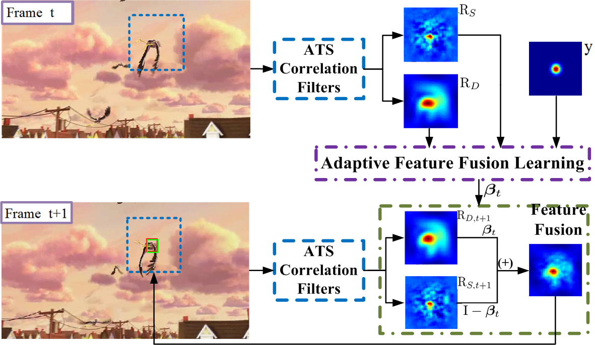

#AFLCF : Adaptive Correlation Filters Feature Fusion Learning for Visual Tracking

Matlab implementation of our AFLCF tracker.

# Abstract 
Tracking algorithms based on discriminative correlation filters (DCFs) usually employ fixed weights to integrate feature response maps from 
multiple templates. However, they fail to exploit the complementarity of multi-feature. These features are against tracking challenges, e.g., 
deformation, illumination variation, and occlusion. In this work, we propose a novel adaptive feature fusion learning DCFs-based tracker (AFLCF). 
Specifically, AFLCF can learn the optimal fusion weights for handcrafted and deep feature responses online. The fused response map owns the 
complementary advantages of multiple features, obtaining a robust object representation. Furthermore, the adaptive temporal smoothing penalty
 adapts to the tracking scenarios with motion variation, avoiding model corruption and ensuring reliable model updates. Extensive experiments on
five challenging visual tracking benchmarks demonstrate the superiority of AFLCF over other state-of-the-art methods. For example, AFLCF achieves 
a gain of 1.9% and 4.4% AUC score on LaSOT compared to ECO and STRCF, respectively.

# Publication
Hongtao Yu and Pengfei Zhu.  
Adaptive Correlation Filters Feature Fusion Learning for Visual Tracking.
https://link.springer.com/chapter/10.1007%2F978-3-030-86383-8_52  
 

# Contact
Hongtao Yu
Email: yuhongtao@tju.edu.cn.

# Installation

### Using git clone

1. Clone the GIT repository:

   $ git clone https://github.com/peace-love243/Adaptive-correlation-filter-feature-fusing-learning-for-visual-object-tracking.git

2. Run the demo script to test the tracker:

   |>> demo_AFLCF

**Note**:
This package requires matconvnet [1], if you want to use CNN features, and PDollar Toolbox [2], if you want to use HOG features. Both these externals are included as git submodules and should be installed by following step 2. above.

## Description and Instructions

### How to run

These files are included:

* run_AFLCF.m  -  runfile for the AFLCF tracker with CNN and hand-crafted features (i.e.,CNN and HOG).

### Features

1. Deep CNN features. It uses matconvnet [1], which is included as a git submodule in external_libs/matconvnet/. The `imagenet-vgg-m-2048` network available at http://www.vlfeat.org/matconvnet/pretrained/ was used. You can try other networks, by placing them in the feature_extraction/networks/ folder.

2. HOG features. It uses the PDollar Toolbox [2], which is included as a git submodule in external_libs/pdollar_toolbox/.

## Acknowledgements

We thank for Dr. `Martin Danelljan` and  `Feng Li` for their valuable help on our work. In this work,
we have borrowed the feature extraction modules from the ECO tracker (https://github.com/martin-danelljan/ECO) and the Spatio-temporal regularization from STRCF (https://github.com/lifeng9472/STRCF).

## References

[1] Webpage: http://www.vlfeat.org/matconvnet/  
    GitHub: https://github.com/vlfeat/matconvnet

[2] Piotr Dollár.  
    "Piotr’s Image and Video Matlab Toolbox (PMT)."  
    Webpage: https://pdollar.github.io/toolbox/  
    GitHub: https://github.com/pdollar/toolbox  
